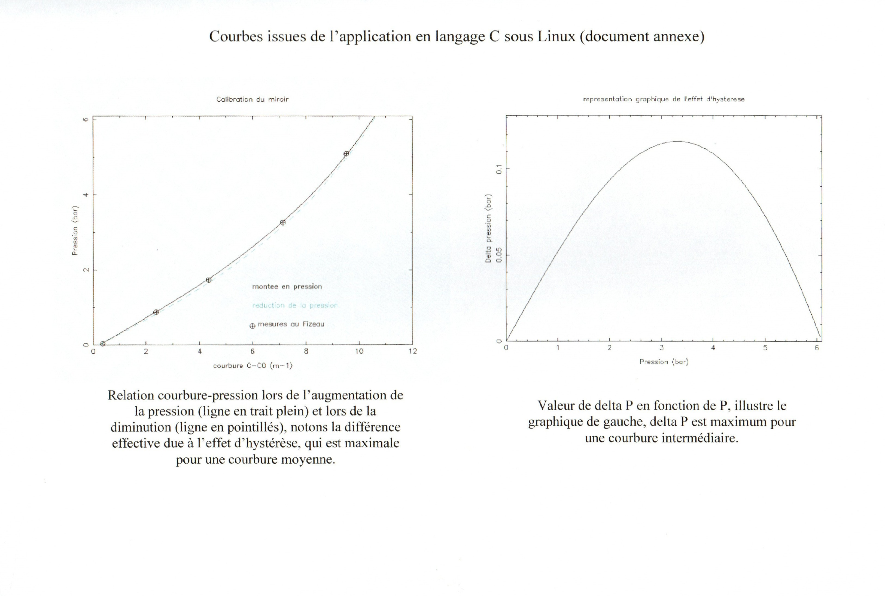

# Adaptive Mirror Curvature Modeling for VLTI — C & VBA Implementation (2005)

This project was conducted during an internship at the *Laboratoire d'Astrophysique de Marseille (LAM)*, in collaboration with CNRS and the University of Provence, between February and April 2005. It focused on the **numerical modeling and experimental validation of adaptive mirrors** used in the Very Large Telescope Interferometer (VLTI) of the European Southern Observatory (ESO).

## 🧭 Project Overview

The goal was to develop and validate a **physical and hysteresis-aware model** linking the **applied pressure** to the **curvature of variable curvature mirrors (VCM)**, critical components of the optical delay lines in the VLTI.

These mirrors dynamically adjust their curvature in real-time using applied pressure to maintain the optical path difference during interferometric observation.

https://en.wikipedia.org/wiki/Very_Large_Telescope


## 🔬 Scientific Background

The VLTI, located at 2700 meters altitude on Cerro Paranal (Chile), uses four 8.2-meter telescopes whose beams are combined interferometrically. Delay lines with VCMs compensate for Earth rotation and observation angle, requiring **precise, real-time curvature control**.

### Modeling Equations

**Pressure vs Curvature (upward cycle):**
```
P = A₁(C - C₀) + A₃(C - C₀)³ + A₅(C - C₀)⁵
```

**Hysteresis correction (downward cycle):**
```
ΔP = Δ₁·C + Δ₃·C³ + Δ₅·C⁵
```

Correction parameters (Δ₁, Δ₃, Δ₅) are derived from α, β, γ and the maximum pressure value (`Pseq`) of the cycle.

## 🖥️ Software Implementation

Two versions were developed:

### ✅ Linux (C ANSI + PGPLOT)
- Terminal-based application using `stdio.h`, `math.h` and `pgplot`.
- Visualization of both upward and downward pressure-curvature curves.
- Reads data files (`fi_fi.dat`, `fizeau-mXX.dat`) for each mirror.
- Interactive input: mirror ID and Pseq value.
- Outputs:
  - Curve 1: Pressure vs Curvature (with hysteresis)
  - Curve 2: ΔP vs Pressure

> 🧠 See `Code_c.md` for full source code.

### 🪟 Windows (VBA in Excel)
- GUI-based with dropdown selection of mirror.
- Generates dynamic charts using macros.
- Accessible to non-programmers for calibration and visualization.

## 🧪 Experimental Validation

Measurements were taken from:
- **Shack-Hartmann wavefront sensor** (HeNe laser + CCD)
- **Fizeau interferometer** (precision curvature reference)

Results from both instruments confirmed the **validity of the model**, including the hysteresis effects.

## 📊 Sample Output



## ⚙️ Embedded System Context

The VCMs are mounted on delay line carriages and controlled by:
- **Piezo-translators** (nanometric precision)
- **PIP6 CMOS microprocessor** (128 MB Flash, Linux Debian)
- **VxWorks-based LCU** (RS232 IR link)
- **Pressure regulators + backup valve system**

This model contributes directly to mirror control optimization.

## 🧠 Key Learnings & Legacy

- Use of real physical modeling in a high-stakes astrophysical context.
- Early hands-on experience with embedded optics and real-world datasets.
- Demonstrated capacity to implement multi-platform, cross-disciplinary scientific software.

---

## 🗃️ Files in this repository

- `README.md` : English summary of the project
- `README_Modele_Courbure_VLTI_FR.md` : Full technical description in French
- `Stage_CNRS_2005.pdf` : Full internship report (in French)
- `Code_c.md` : Source code (C, Linux version)
- `Hysteresis_curves.jpg` : Sample output
- `DU_astronomie.pdf` : Astronomy certificate, Université Paris XI
- `certificat_developpeur.pdf` : Developer training certificate (AFPA, C language)

---

## 📅 Year: 2005 | Author: Jérôme Frasson  
For historical, educational and portfolio use.  
Now part of the **Lyra Projects Archive** — merging environmental science, AI, and physical modeling.

---

🔗 **See also my related work on GitHub**:
[Main GitHub profile](https://github.com/Jerome-openclassroom)  
- [Related project: AI applied to Astrophysics](https://github.com/Jerome-openclassroom/AI_Astrophysics)  
- [Related project: Artisan Spectroscopy & Plasma Physics](https://github.com/Jerome-openclassroom/Artisan_Spectroscopy_Plasma_Physics)
